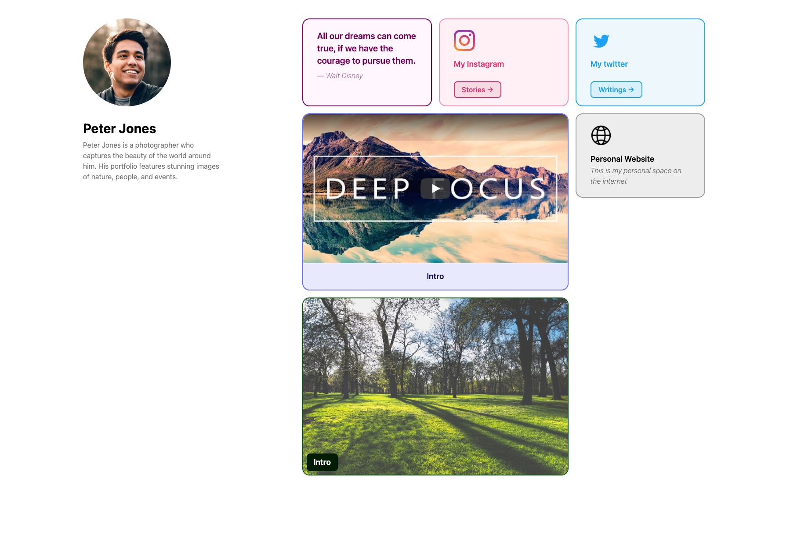

# Linkverse - a one page link-in-bio page with Astro

Linkverse is a one-page link-in-bio page that makes it easy to share your social media profiles, contact information, and other links with the world. It's powered by Astro, a free and open-source framework for building beautiful and responsive websites.


[](https://stackblitz.com/github/apvarun/linkverse/tree/main)
[](https://codesandbox.io/p/sandbox/github/apvarun/linkverse/tree/main)
[](https://codespaces.new/apvarun/linkverse)



## Features

- One-page design: Linkverse is a single page website, so it's easy to navigate and share.
- Astro framework: Linkverse is built on the Astro framework, which makes it easy to customize and extend.
- Customizable colors and fonts: You can change the colors and fonts of Linkverse to match your brand.
- Responsive design: Linkverse looks great on all devices, from desktops to smartphones.

## 🚀 Project Structure

Inside of your Astro project, you'll see the following folders and files:

```
/
├── public/
│   └── favicon.svg # Static assets
├── src/
│   ├── components/
│   │   └── ...
│   ├── layouts/
│   │   └── ...
│   ├── pages/
│   │   └── ...
│   └── content/cards/
│   │   └── ... # Markdown files that store the information for the cards
│   └── constants.json # Global constant values
└── package.json
```

## License

MIT
